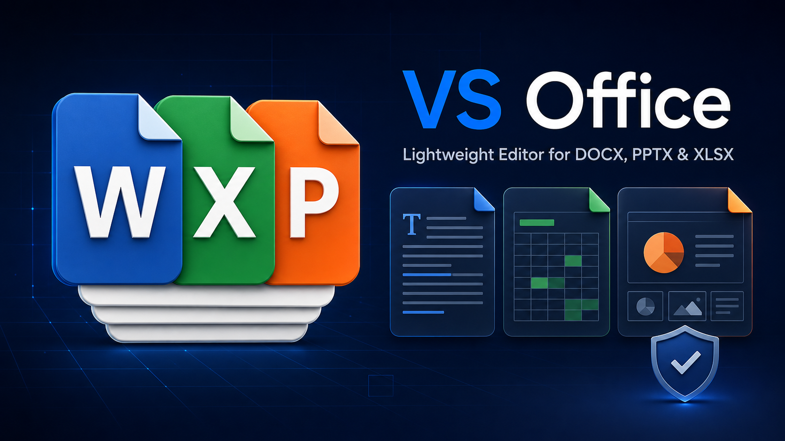

# VS Office - Lightweight Editor

<p align="center">
  
</p>

Open and make focused edits to Microsoft Office Open XML files without leaving Visual Studio Code.

VS Office is designed for quick reviews and small corrections in `.docx`, `.pptx`, and `.xlsx` files. Instead of rebuilding the entire document, it changes only the selected OOXML text or cell data and verifies that unrelated package parts remain untouched.

## Why VS Office?

- **Stay in your editor:** inspect supported Office files directly in Visual Studio Code.
- **Make focused corrections:** edit existing Word text runs, PowerPoint text runs, and non-formula Excel cells.
- **Preserve unrelated content:** do not regenerate themes, styles, images, slide masters, formulas, embedded files, or other untouched OOXML parts.
- **Validate every save:** recheck ZIP CRC values and compare untouched parts with SHA-256 hashes before accepting the result.
- **Recover when needed:** create a backup before overwriting by default, and support both standard Save and Save As.

## Format support

| Format | Preview | Focused editing |
| --- | --- | --- |
| DOCX | Page preview powered by `docx-preview`, plus an editable text outline | Existing `w:t` text runs |
| PPTX | Lightweight structural view of slide order, text, and image counts | Existing `a:t` text runs |
| XLSX | Spreadsheet grid of up to 200 rows by 50 columns | Non-formula cells; shared-string cells are converted individually to `inlineStr` |

## Save protection

VS Office uses a conservative save pipeline:

1. Apply only the requested text or cell changes to the OOXML package.
2. Write the result to a temporary file in the same directory.
3. Validate ZIP integrity and verify every untouched package part with SHA-256.
4. Create a recoverable copy in `.vs-office-backups` when backups are enabled.
5. Replace the original atomically only after validation succeeds.

Digitally signed and encrypted packages open in read-only mode. Formula cells are also read-only.

## Getting started

1. Install **VS Office - Lightweight Editor** from the Visual Studio Marketplace.
2. Open a `.docx`, `.pptx`, or `.xlsx` file in Visual Studio Code.
3. Review the preview or grid and edit a supported text or cell value.
4. Press `Ctrl+S` to save, or use **Save As** to create a separate file.

Automatic backups are enabled by default. Change `vsOffice.createBackupOnSave` in Visual Studio Code Settings if required.

## Important limitations

VS Office is a lightweight editor, not a replacement rendering engine for Microsoft Word, PowerPoint, or Excel. Browser HTML and Microsoft Office use different text-layout engines, so pixel-perfect preview parity cannot be guaranteed. Editing text can cause normal line wrapping, pagination, or slide reflow when the file is reopened in Microsoft Office.

The extension is designed to preserve unrelated OOXML content and layout data, but final deliverables should always be verified in Microsoft Office.

## Development

```powershell
npm install
npm test
```

Open this folder in Visual Studio Code and press `F5` to start an Extension Development Host.

## Open-source components

- [docxjs / docx-preview](https://github.com/VolodymyrBaydalka/docxjs) (Apache-2.0) renders DOCX content as HTML.
- [JSZip](https://github.com/Stuk/jszip) (MIT / GPLv3) reads and writes OOXML ZIP containers and validates CRC values.

[SheetJS Community Edition](https://git.sheetjs.com/sheetjs/sheetjs) was evaluated for XLSX support. It is not used for saving because regenerating an entire workbook can discard unknown features or layout information. PPTXjs-based renderers were also evaluated, but the current PPTX implementation intentionally uses a structural view because those projects could not provide the required fidelity guarantees.
